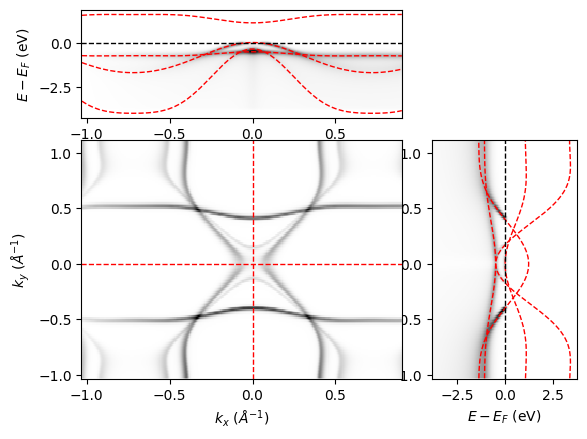
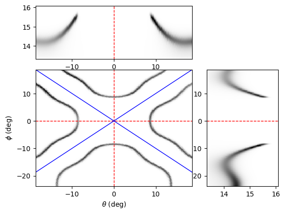
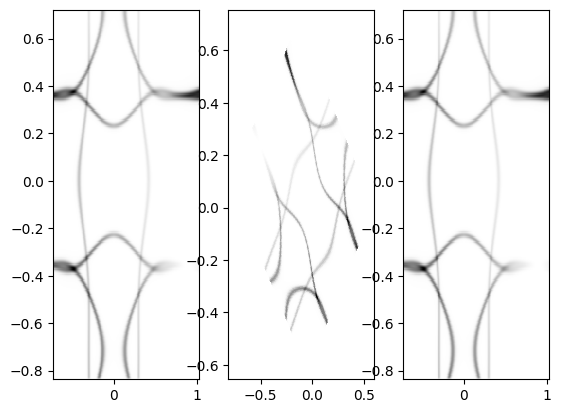
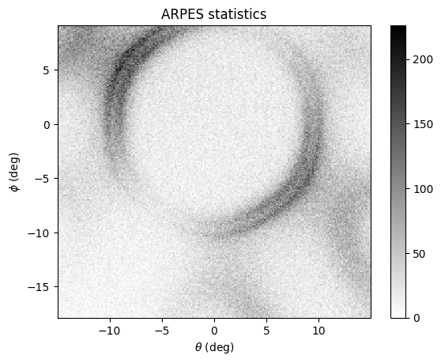

.. toctree::
   :maxdepth: 2

ARPES module
************
.. automodule:: aurelia_arpes

Define Bands
============
The object *Bands* defines the electronic dispersion. The in-plane k-path -- specified by a list of :math:`k_x` and :math:`k_y` points -- and the band dispersion is calculated along the path according to a specified tight-binding model. Alternatively, one can also import the band dispersion from an external file.
One actually does not need any input to initialize the object *Bands*, the reason is because we want to randomly generate dispersions and use them to train deep-learning algorithms. Here, variety matters more than accuracy. Thus one can simply write:
::

    B = Bands()

However, user may alternatively specify the symmetry, momentum space limits, number of bands, and number of points in the calculation here. An example is shown below:

::

    B = Bands(Npts = [200, 100], symmetry = 'square', klim = np.array([[-1.2,-1], [1.2, 1]],
    Nbands = np.random.randint(1,5)), warp = 'yes', edges=1.25)

Following this, one can create the k-path and the tight-binding calculation (see :ref:`derivations` for details).:
::

    B.Make_kpath()
    B.Make_bands()

Alternatively, one can import the band dispersion itself from an external file:
::

  B = Bands()
  B.Import_bands(filename = 'Graphene_bands.csv')      

In which case the default inputs will be fetched from the file itself and overwritten with the correct values from the file. 

Calculate Spectra
=================
The object *Spec* calculates the photoemission spectra one would expect from the dispersion. To initialize the calculation, the minimum input needed is the *Bands* object.
::

  S = Spec(B)

Additionally, one can define the dimension of the calculation and the energy dimension :math:`\omega`.
The dimension input is a string. Three modes are available, "cube", "sliceEk", and "slicekk", corresponding to 3D, dispersion, and Fermi-surface cuts.
These modes are defined for computational time and file size considerations. For instance:
::

  Spec=Spec(B, dimension='cube', Omega = np.linspace(-1, 0.1, 300))
  
Self-energy
-----------

Optionally, we define the self-energy needed to calculate the spectral function (See :ref:`derivations` for details.). Here, two inputs are given in the simulator, Fermi-liquid, given by the string ``"FL"``, and electron-boson kink, given by the string ``"kink"``. 
Parameters for the self-energy may be defined by the user as a part of the dictionary, or they are randomly generated.

1. Fermi-liquid self-energy

  ::

    SE_in={"type": 'FL'}
    S.Make_self_energy(SE = SE_in)

2. Electron-boson kink self-energy
The self-energy is phenomenological:

  ::

    SE_in={"type": 'kink'}
    S.Make_self_energy(SE = SE_in)

Photoemission matrix-elements
-----------------------------

Next, the photoemission matrix-elements are also defined here. 
We note that this function is not a real calculation of the photoemission matrix elements, but rather, it aims to add intensity variation to the simulation in a way that mimics how real photoemission matrix elements affect the measured spectra.
For details on how these matrix elements are defined, See :ref:`derivations` for details.

::
  
  ME_in = {"type": ['poly','symm','rot']}
  S = S.Make_matrix_elements(ME = ME_in)

Calculate intensity and add resolution broadening
-------------------------------------------------

To calculate the photoemission spectra and add the resolution broadening, we define the electronic temperature and experimental resolutions.
These parameters are collected in the modifier object, which is defined in the ``aurelia_static_vars`` module.
::

  res = {"ER": np.random.uniform(0.01, 0.5), "kR": np.random.uniform(0.01, 0.05)}
  Temp = np.random.uniform(5, 300)
  m=mod(resolution= res, temperature=Temp)

Finally, we calculate the photoemission intensity and add the resolution broadening via: 

:: 

  S.Make_specfun(m)
  S.Make_specmod(m)

The spectral function can be shown using the ``aurelia_plots`` module.
Below is a simulation of spectral intensity for a system with rectangular (C2) symmetry, where ``spec.dimension = "cube"``.
::

  from aurelia.aurelia_plots import show_spectra as sh
  sh.Make_spec_plot(spec)

Simulate ARPES
==============
The object *ARPES* takes the spectral intensity calculated by the object *Spec* as a function of binding energy and momentum, and converts it to kinetic energy and emission angle. 
Real experimental conditions, such as the presence of rotational and flake domains, the number of electrons collected, detector sensitivity, experimental background, etc. are also included, so that the final simulation closely resembles what may be measured in experiment under both optimal, and --more importantly-- suboptimal conditions. 

To initialize the calculation, the minimum input needed is the *Spec* object and the *exp* object. 
The former contains information about the spectral intensity, and the latter contains experimental conditions (See :ref:`static_vars` for details.). 

::

  arpes = ARPES(spec, exp)

Optionally, one could also define the angular acceptance limits of the analyzer and the dimension of the simulation. 
Note that by default, the dimension of the *ARPES* simulation is the same as that of the *Spec* calculation.
However, to save computational time, if ``spec.dimension = "cube"``, then the ``arpes.dimension`` can be reduced to ``"sliceEk"`` or ``"slicekk"`` as well. For example:

::

  th_lim = {"th": np.array([-15, 15])}
  arpes = ARPES(spec, exp, ang_lim = th_lim, dimension = 'sliceEk')

Note that at this step, the angle limits (in this case th_lim) are padded at the edges. 
The (optional) creation of domains and offset angles will create artifacts at the edges of the image. 
In the final step of the simulation, the padded edges will be cropped to remove these artifacts.

Momentum-to-angle conversion
----------------------------

With these variables defined, we can make the conversion from momentum space to angles. See :ref:`derivations` for details. 
In this function, the background intensity is initialized as zeros, and the detector response is initialized as ones. 

::

  arpes.Make_angle_conv(const=0)
   
Here, if ``arpes.dimension`` is ``"sliceEk"`` or ``"slicekk"``, the constant of the third dimension (:math:`\phi` or :math:`E_k`, respectively) must be given, or default values are used.

The spectral function can be shown using the ``aurelia_plots`` module.
Below is a simulation of the arpes intensity for a system with square (C4) symmetry, where ``arpes.dimension = "cube"``. We've rotated the spectra by 45 degrees in the azimuth for easy visualization.
::

  from aurelia.aurelia_plots import show_spectra as sh
  sh.Make_arpes_plot(arpes, exp)

To check that the warp is done correctly, we add a diagnostic that double checks the conversion from momentum to angle. 
Note that this function can only be run if ``spec.dimension = arpes.dimension = "slicekk"``.
::

  arpes.Make_kwarp_check()

Here, the angle mesh is first calculated as in ``arpes.Make_angle_conv()``, then, we skip the interpolation and simply do the angle-to-momentum conversion, which is typically done for ARPES experiments. 
The warp is done forwards and backwards to show that the original k-mesh is reproduced. See :ref:`derivations` for details.

Add electron counting statistics
--------------------------------

From here, assuming zero background intensity and a perfect detector response, we can go ahead and simulate the ARPES experimental spectra based on :math:`N_e` electron events specified in the *exp* object.

::

  arpes.Make_statistics(exp)

Then we crop the edges to remove artifacts.

::
  
  arpes.Crop_edges()

Note that the above function is called in the plotting function, so one does not need to crop it before plotting. 
Below is a simulation of the arpes statistics for a system with hexagonal (C3) symmetry, where ``arpes.dimension = "slicekk"``. We've rotated the spectra by 30 degrees in the azimuth for easy visualization.
::

  from aurelia.aurelia_plots import show_spectra as sh
  sh.Make_stats_plot(arpes)

