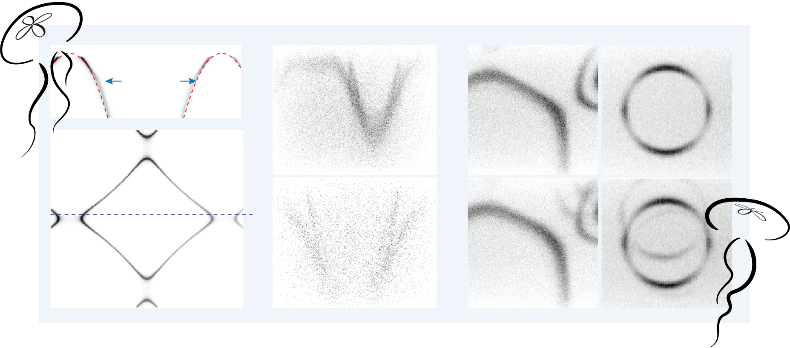

Welcome to *aurelia* !
=====================================

The package **aurelia** is developed by MengXing Na and Matteo Michiardi at the University of British Columbia.  
It is designed to simulate spectra from angle-resolved photoemission spectroscopy (ARPES) experiments,  
including realistic experimental artifacts, for the purpose of training machine-learning algorithms.

Here you will find all relevant modules and libraries for running calculations with this package.

For questions not covered in the documentation, or for collaborations, please contact:  
``mengxing.na@gmail.com``

.. note::

   If you are new to Aurelia, check out the :doc:`quickstart` guide to get started!

.. toctree::
   :maxdepth: 1
   :caption: Contents:

   installation
   quickstart
   arpes
   experiment
   plots
   save
   derivations
   api

