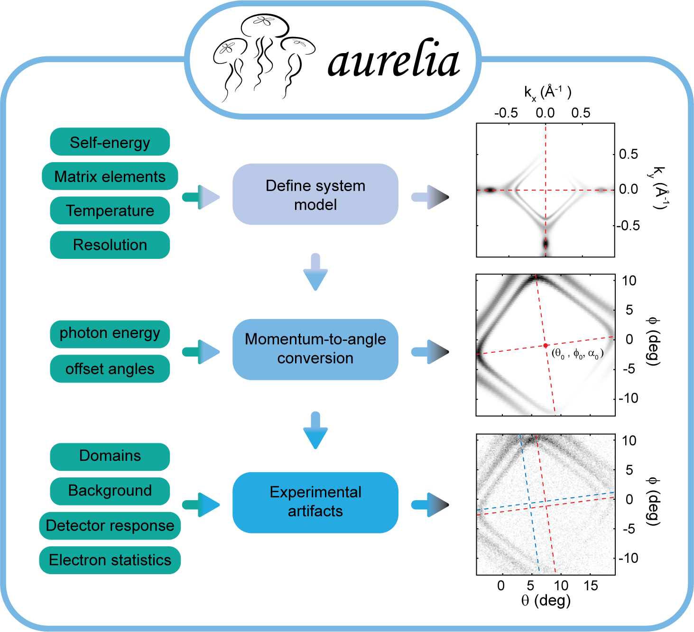

Quickstart
==========

Welcome to **aurelia** Quick Start!  
This guide demonstrates how to use the Aurelia package to simulate ARPES spectra, including realistic experimental artifacts.
The **aurelia** workflow is briefly illustrated below: 

Step 1: Import aurelia classes
------------------------------

.. code-block:: python

    import numpy as np
    import os
    from aurelia.aurelia_arpes import Bands, Spec, ARPES
    from aurelia.aurelia_static_vars import mod, domain, experiment
    from aurelia.aurelia_plots import show_spectra as sh
    from aurelia import aurelia_hdf5_saving as sv

Step 2: Define the bands
------------------------

This defines a tight-binding band structure along a k-path and prints relevant variables for inspection.

.. code-block:: python

    # Number of points in theta and phi
    B = Bands(Npts=[200, 250])
    B.Make_kpath()
    B.Make_bands()
    B.print_variables()

Step 3: Calculate spectra
-------------------------

This computes the spectral function for the bands and plots the spectrum.

.. code-block:: python

    spec = Spec(B, dimension='sliceEk')
    spec.Make_matrix_elements()
    spec.Make_self_energy(SE={"type": 'FL'})  # Fermi-liquid self-energy
    m = mod()
    spec.Make_specfun(m)
    spec.Make_specmod(m)
    spec.print_variables()
    sh.Make_spec_plot(spec)

Step 4: Simulate ARPES spectra
------------------------------

This defines the experimental artifacts and converts the spectral function to emitted angles and kinetic energies.

.. code-block:: python

    # Define experimental angles
    ang_in = {"th": np.deg2rad([-15, 15]),
              "ph": np.deg2rad([-10, 10])}

    # Define detector properties
    det = {"response": 'center',
           "sensitivity": np.random.uniform(0.5, 1),
           "type": 'HA',
           "slit": "horizontal",
           "counting mode": "ADC"}

    # Define background
    bg = {"type": ('flat', 'poly')}

    # Create experiment and ARPES objects
    exp = experiment(spec, detector=det, bkgd=bg, Ne=10**6)
    arpes = ARPES(spec, exp, ang_lim=ang_in)
    arpes.Make_angle_conv()
    sh.Make_arpes_plot(arpes, exp)

Step 5: Add artifacts and statistics
------------------------------------

This adds realistic experimental effects like detector sensitivity and background noise, and applies statistical sampling to simulate electron counts. The final “measured” ARPES spectrum is shown, and relevant variables are plotted.

.. code-block:: python

    arpes = exp.Make_bkgd(arpes)                    # Add background
    arpes = exp.Make_detector_responsivity(arpes)   # Detector response
    arpes.Make_statistics(exp)                      # Statistical noise
    sh.Make_stats_plot(arpes)
    arpes.print_variables()
